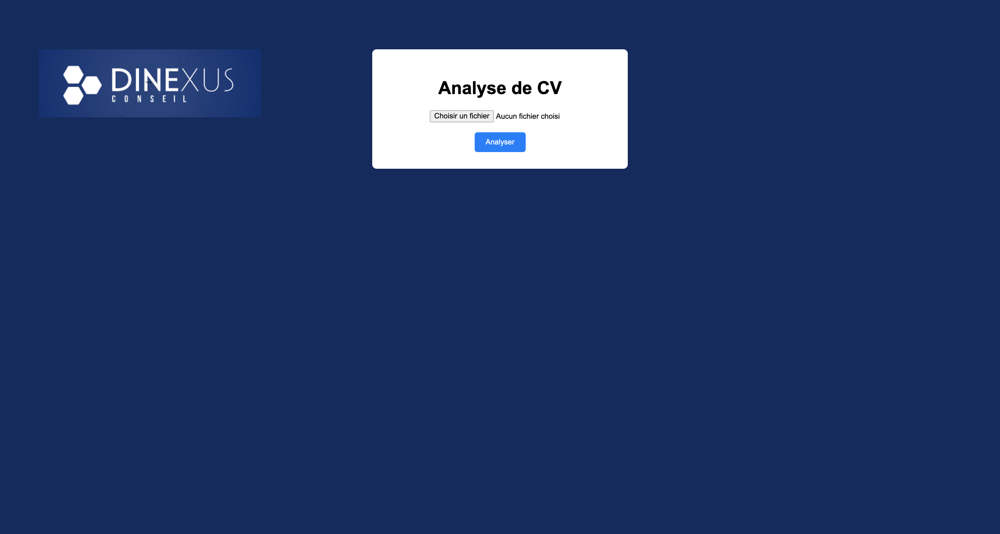
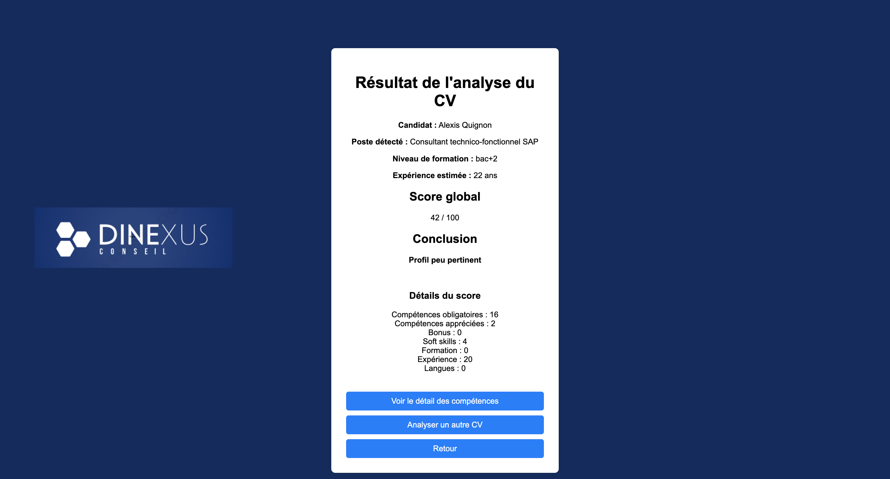
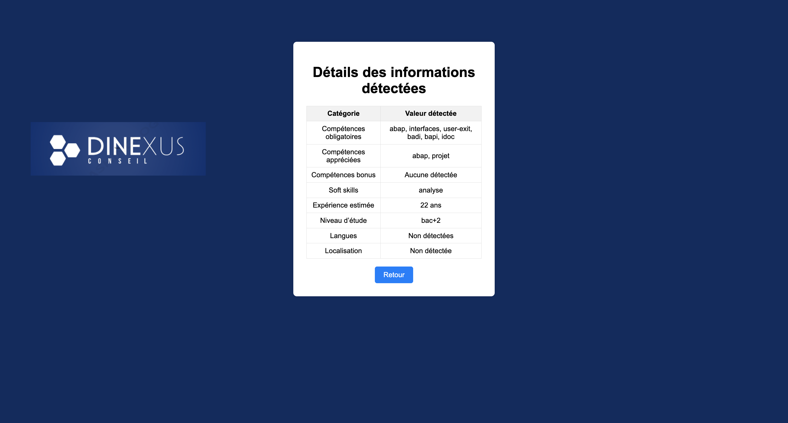

# Outil d’analyse et d’évaluation de CV

Projet réalisé dans le cadre d’un stage au sein de **Dinexus Conseil**, cabinet de conseil spécialisé dans le domaine SAP.

L’objectif du projet est de développer un outil permettant d’effectuer un **premier tri de candidatures** en analysant automatiquement un CV et en le comparant à une fiche de poste paramétrable.

L’application repose sur un système de **parsing et de scoring basé sur des règles métier explicables**, sans recours à l’intelligence artificielle.

**Technologies principales :** Python · Flask · pdfplumber · Regex · JSON · HTML/CSS

---

## Confidentialité

Ce projet ayant été réalisé dans un contexte professionnel, le **code source n’est pas publié** dans ce dépôt.

Ce repository présente uniquement :

- le fonctionnement général de l’application ;
- son architecture ;
- les principales fonctionnalités développées ;
- les technologies utilisées ;
- des captures d’écran de l’interface.

Les données utilisées dans les captures d’écran sont fictives ou anonymisées.

---

## Objectif du projet

L’application permet de :

- importer un CV au format PDF, DOC ou DOCX ;
- extraire automatiquement les principales informations du candidat ;
- comparer le profil avec une fiche de poste ;
- identifier les compétences présentes et manquantes ;
- estimer l’expérience professionnelle ;
- détecter le niveau d’études ;
- analyser certaines langues demandées ;
- calculer un score de pertinence sur 100 ;
- attribuer un verdict ;
- afficher les résultats dans une interface web.

L’objectif est d’aider le recruteur lors du **premier tri des candidatures**.

Le score constitue uniquement une **aide à la décision** et ne remplace pas l’évaluation finale du recruteur.

---

## Technologies utilisées

- Python
- Flask
- pdfplumber
- Expressions régulières (`re`)
- JSON
- HTML
- CSS
- LibreOffice pour la conversion des fichiers DOC/DOCX vers PDF

---

## Fonctionnement général

```text
CV
 │
 ▼
Extraction du texte
 │
 ▼
Parsing
 │
 ├── Identité
 ├── Compétences
 ├── Expérience
 ├── Formation
 ├── Langues
 └── Localisation
 │
 ▼
Comparaison avec la fiche de poste
 │
 ▼
Scoring
 │
 ▼
Verdict
 │
 ▼
Affichage dans l’interface web
```

---

## Architecture du projet

Le code source n’étant pas publié, l’arborescence suivante présente uniquement l’**organisation générale de l’application**.

```text
cv-ranking-ui/
│
├── app.py
│
├── backend/
│   ├── parser.py
│   └── scoring.py
│
├── templates/
│   ├── index.html
│   ├── result.html
│   └── details.html
│
├── static/
│   └── style.css
│
├── data/
│   ├── cvs/
│   └── offre.json
│
└── README.md
```

---

## `app.py`

Fichier principal de l’application.

Il permet notamment de :

- lancer le serveur Flask ;
- gérer l’import des CV ;
- vérifier les formats de fichiers autorisés ;
- appeler le module de parsing ;
- appeler le module de scoring ;
- transmettre les résultats aux différentes pages HTML.

---

## Module de parsing

Le module `backend/parser.py` analyse le contenu du CV afin d’en extraire les informations utiles.

Il permet notamment de détecter :

- le nom et le prénom ;
- l’adresse e-mail ;
- le numéro de téléphone ;
- le poste ou titre du profil ;
- les compétences techniques ;
- les soft skills ;
- le niveau d’études ;
- l’expérience professionnelle estimée ;
- les langues ;
- la localisation.

L’analyse repose principalement sur :

- des expressions régulières ;
- des recherches de mots-clés ;
- des règles de détection définies dans l’application.

---

## Module de scoring

Le module `backend/scoring.py` compare les informations extraites du CV avec les critères définis dans la fiche de poste.

Il calcule plusieurs composantes du score avant de produire un résultat global sur **100 points**.

Le système est volontairement basé sur des **règles métier explicables**, afin que le résultat puisse être facilement compris et justifié.

---

## Fiche de poste paramétrable

La fiche de poste constitue le référentiel utilisé pour analyser le CV.

Elle est stockée dans un fichier `offre.json`, ce qui permet de modifier les critères de recherche **sans modifier directement le code Python**.

Exemple simplifié :

```json
{
  "poste": "Consultant SAP BC S/4HANA",
  "niveau": "confirmé",
  "experience_min": 5,
  "niveau_etude_min": "bac+5",

  "competences": {
    "obligatoires": [],
    "appreciees": [],
    "bonus": []
  },

  "soft_skills": [],

  "ponderation": {
    "obligatoires": 50,
    "appreciees": 20,
    "bonus": 10,
    "experience": 15,
    "formation": 5
  }
}
```

La fiche de poste peut notamment contenir :

- les compétences obligatoires ;
- les compétences appréciées ;
- les compétences bonus ;
- les soft skills ;
- l’expérience minimale ;
- le niveau d’études minimum ;
- les langues demandées ;
- les pondérations utilisées pour le scoring.

Le système permet également de regrouper plusieurs écritures correspondant à une même compétence afin de limiter les doublons.

Par exemple :

```text
S/4HANA
S4HANA
S/4 hana
```

Ces différentes écritures peuvent être considérées comme correspondant à la même compétence.

---

## Système de scoring

Le scoring repose sur plusieurs critères définis dans la fiche de poste.

Exemple de répartition :

| Critère | Score maximum |
| --- | ---: |
| Compétences obligatoires | 50 |
| Compétences appréciées | 20 |
| Compétences bonus | 10 |
| Expérience | 15 |
| Formation | 5 |
| **Total** | **100** |

Les compétences obligatoires disposent du poids le plus important.

L’objectif est notamment d’éviter qu’un candidat obtienne un score élevé uniquement grâce à des compétences secondaires alors que certaines compétences indispensables sont absentes.

---

## Verdict

À partir du score obtenu, l’application attribue un verdict permettant de faciliter la lecture du résultat.

| Score | Verdict |
| --- | --- |
| ≥ 75 | Profil pertinent |
| 55 à 74 | À étudier |
| < 55 | Peu pertinent |

Ce verdict reste uniquement une **aide au premier tri des candidatures**.

La décision finale reste à la charge du recruteur.

---

## Interface web

L’application dispose d’une interface web développée avec **Flask, HTML et CSS**.

Elle comporte trois pages principales.

### Page d’accueil — `index.html`

La page d’accueil permet à l’utilisateur de déposer un CV.

Formats acceptés :

- PDF
- DOC
- DOCX

Un message d’erreur est affiché lorsqu’un format non autorisé est envoyé.

### Page de résultat — `result.html`

Cette page présente notamment :

- le score global ;
- le verdict ;
- un résumé du scoring ;
- les principaux éléments détectés dans le CV.

### Page de détails — `details.html`

Cette page permet de consulter plus précisément les informations extraites :

- compétences trouvées ;
- compétences manquantes ;
- soft skills ;
- expérience estimée ;
- formation ;
- langues ;
- localisation ;
- autres informations détectées.

---

## Aperçu de l’interface

> Les captures présentées dans ce repository utilisent uniquement des données fictives ou anonymisées.

### Import d’un CV



### Résultat de l’analyse



### Détails du profil



---

## Gestion des fichiers DOC et DOCX

Les fichiers PDF peuvent être analysés directement par l’application.

Pour les fichiers DOC et DOCX, l’application utilise **LibreOffice en mode headless** afin de convertir automatiquement le document en PDF avant son analyse.

Le fonctionnement général est donc :

```text
DOC / DOCX
    │
    ▼
LibreOffice
    │
    ▼
Conversion en PDF
    │
    ▼
Extraction du texte
    │
    ▼
Analyse
```

---

## Installation

> Le code source n’étant pas publié dans ce repository, cette section décrit uniquement l’environnement technique utilisé pendant le développement du projet.

### Prérequis

#### macOS

- Python 3.x
- pip
- Flask
- pdfplumber
- LibreOffice
- environnement virtuel Python recommandé

#### Windows

- Python 3.x
- pip
- Flask
- pdfplumber
- LibreOffice
- environnement virtuel Python recommandé

Lors de l’installation de Python sous Windows, il est recommandé de cocher :

```text
Add Python to PATH
```

---

## Environnement Python

Création d’un environnement virtuel :

```bash
python -m venv .venv
```

### macOS / Linux

```bash
source .venv/bin/activate
```

### Windows — Invite de commandes

```cmd
.venv\Scripts\activate
```

### Windows — PowerShell

```powershell
.venv\Scripts\Activate.ps1
```

Installation des principales dépendances :

```bash
pip install flask pdfplumber
```

---

## Lancement de l’application

Pendant le développement, l’application était lancée avec :

```bash
python app.py
```

Sous Windows :

```bash
py app.py
```

Le serveur Flask est ensuite accessible localement, généralement à l’adresse :

```text
http://127.0.0.1:5000
```

---

## Limites actuelles

Le projet reste un prototype.

Certaines limites concernent notamment :

- la diversité des mises en page des CV ;
- la détection automatique des noms et titres ;
- l’estimation de certaines périodes d’expérience ;
- les différentes formulations possibles d’une même compétence ;
- la qualité du texte extrait depuis certains fichiers PDF ;
- la détection de certaines informations lorsque la structure du CV est très atypique.

---

## Améliorations possibles

Plusieurs évolutions pourraient être envisagées :

- gérer plusieurs fiches de poste ;
- permettre de modifier la fiche de poste directement depuis l’interface ;
- ajouter une base de données ;
- conserver un historique des candidats analysés ;
- améliorer la gestion des synonymes ;
- améliorer la détection des informations personnelles ;
- permettre l’analyse de plusieurs CV simultanément ;
- améliorer l’interface utilisateur ;
- générer automatiquement un rapport de synthèse ;
- ajouter des fonctionnalités de comparaison entre plusieurs candidatures.

---

## Contexte du projet

Ce projet a été réalisé dans le cadre d’un **stage étudiant chez Dinexus Conseil**, cabinet spécialisé dans le domaine SAP.

L’objectif était de répondre à un besoin concret : faciliter le premier tri des candidatures grâce à un outil simple, configurable et transparent.

Le projet m’a notamment permis de travailler sur :

- le développement en Python ;
- la création d’une application web avec Flask ;
- le parsing de documents ;
- les expressions régulières ;
- la manipulation de données JSON ;
- la conception d’un algorithme de scoring ;
- la traduction de règles métier en logique informatique ;
- la conception d’une interface permettant de présenter les résultats de manière claire.

---

## Auteur

**Mohamed Amine Chaguetmi**

Étudiant en **L3 Informatique — Parcours MIAGE**  
Université de Haute-Alsace

[LinkedIn](https://www.linkedin.com/in/mohamed-amine-chaguetmi)

---

## Remarque

Ce repository constitue une **présentation portfolio du projet**.

Le code source et les éventuelles données professionnelles associées au projet ne sont pas rendus publics.
